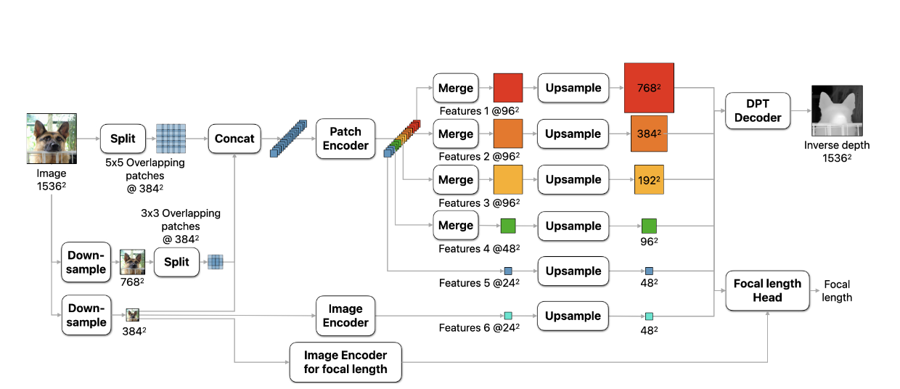

# Depth Pro Sample

This is an example project using [DepthPro](https://huggingface.co/apple/DepthPro) for monocular depth estimation.

## Instructions

1. Download models from [huggingface](https://huggingface.co/KeighBee/coreml-DepthPro) and place them in the models folder in `DepthProSample`. 
2. Open `DepthProSample.xcodeproj` in XCode.
3. Build & run the project!

## Download

CoreML packages are available in [KeighBee/coreml-DepthPro](https://huggingface.co/KeighBee/coreml-DepthPro).

Install `huggingface-cli`

```bash
brew install huggingface-cli
```

Download `DepthPro-pruned10-Qlinear.mlpackage` and `DepthProNormalizedInverseDepth-pruned10-Qlinear.mlpackage` to the `models` directory:

```bash
huggingface-cli download \
  --local-dir models --local-dir-use-symlinks False \
  KeighBee/coreml-DepthPro \
  --include "DepthProNormalizedInverseDepth-pruned10-Qlinear.mlpackage/*" "DepthPro-pruned10-Qlinear.mlpackage/*"
```

To download all the model versions, including quantized ones, skip the `--include` argument.

## Model Description

DepthPro is a monocular depth estimation model. This means that it is trained to predict depth on a single image.

The paper is [here](https://arxiv.org/pdf/2410.02073)



Notice that the architecture takes in a fixed size input $1536 \times 1536$, however, if you run the depth pro model from the repository, you'll notice it can take in any sized image. Before any of the above happens, the image is bilinearly downscaled to $1536 \times 1536$, then after going through the network it is bilinearly upscaled back into its original size. Bicubic is a nicer interpolation method, but it is not supported but CoreML yet.

The most confusing part of this diagram is the part around the "Patch Encoder". The patch encoder is a DINOv2 style model (specifically [this](https://huggingface.co/timm/vit_large_patch14_dinov2.lvd142m/tree/main)) which takes in the 35 $384 \times 384$ 3 color patches and processes each patch into 576 $32 \times 32$ sub patches. Then the output of the patch encoder is reshaped back 35 $24 \times 24$ 1024 color patches. the outputs are then merged back into the first 3 feature maps corresponding to the 3 scales of the images. The last two feature maps are created by taking intermediate layers from the patch encoder.

The output of the model predicts depth in a "cannonical" coordinate system. along with a prediction for the field of view (FOV) in degrees. Given the original width of the input image and the focal length (which can be derived from the FOV), we can adjust the model's canonical camera representation to measure depth in real-world units (meters).

Here is a diagram of a pinhole camera for reference:


